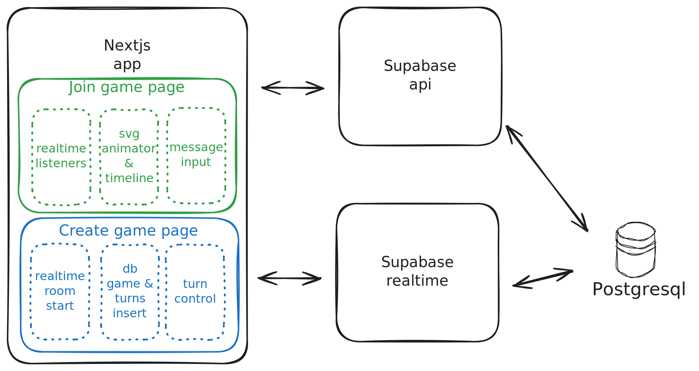

# GPicTionary - Pictionary game assisted by GPT

This game was quickly POCed and developed for an AllHands presentation at [Woflow](https://www.woflow.com/). By quickly POCed I mean it was just [eXtreme Go-Horse process](https://gist.github.com/banaslee/4147370)

## Install Nodejs dependencies
  
  ```bash
  npm install
  ```

## Copy .env.example to .env and fill in the required environment variables
  
  ```bash
  cp .env.example .env
  ```

  You will need to fill the following environment variables, 
  which you can get by either running `supabase` locally or 
  by going to your project settings in the Supabase dashboard:

  ```
  NEXT_PUBLIC_SUPABASE_URL=
  NEXT_PUBLIC_SUPABASE_ANON_KEY=
  ```


## Getting Started with NextJS server

  First, run the development server:
  ```bash
  npm run dev
  ```

# Project Structure
  

# Credits
  - Project was bootstrapped from supabase [realtime example]( https://github.com/supabase/realtime/tree/main/demo):

# Learnings
  - GPT can be nice, but specific purpose models can be better, for example: https://github.com/ximinng/SVGDreamer
  - Streaming data with supabase: https://www.youtube.com/watch?v=9N66JBRLNYU
  - Nextjs App Router: https://nextjs.org/docs/app/building-your-application/routing
  - Embeddings 101: https://youtu.be/Yhtjd7yGGGA?t=821
  - PGVector: https://github.com/pgvector/pgvector

